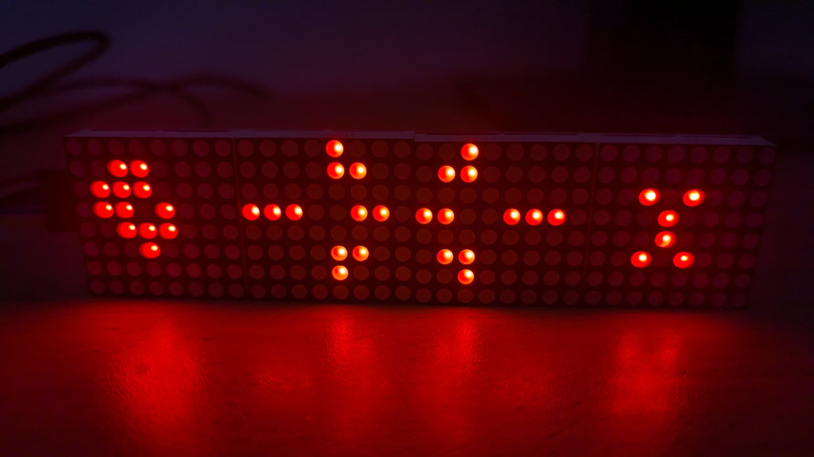

   

# Conway's Game of Life in Silicon

This is a hardware implementation of [Conway's Game of Life](https://en.wikipedia.org/wiki/Conway%27s_Game_of_Life) in Verilog. It is designed for [Tiny Tapeout](https://tinytapeout.com).

## What is Tiny Tapeout?

Tiny Tapeout is an educational project that aims to make it easier and cheaper than ever to get your digital and analog designs manufactured on a real chip.

To learn more and get started, visit https://tinytapeout.com.
